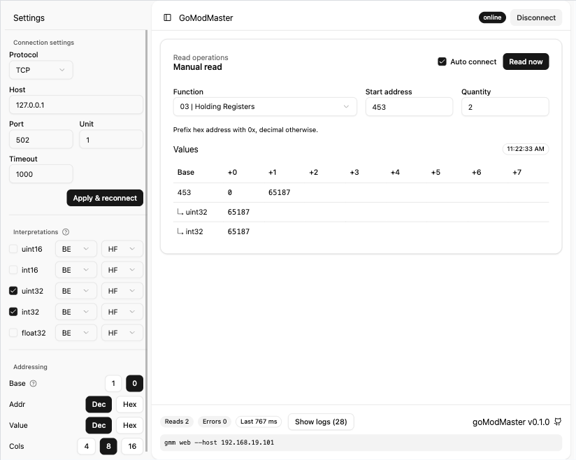

# goModMaster

Web-based Modbus master inspired by [QModMaster](https://sourceforge.net/projects/qmodmaster/); a TUI is planned.



## Features

- [x] Read-only Modbus client (TCP + RTU)
- [ ] Write operations (planned)
- [ ] TUI mode (planned)

## Install

No install needed. Download the binary from latest [release](https://github.com/d21d3q/goModMaster/releases/latest) and run it.

## How to use

Launch the web UI:

```sh
gmm web
```

Common flags: `--host/--port` for TCP, `--serial --framing --speed --databits --parity --stopbits` for RTU, and `--no-token` to skip auth. TCP is the default when no serial flags are provided, and serial flags cannot be combined with `--host/--port`. You can pass serial connection options up front, or start with defaults (RTU 9600/8N1) and adjust in the UI later. The UI shows the exact invocation string so you can reuse it verbatim.

```bash
Launch local web UI

Usage:
  gmm web [flags]

Flags:
  -h, --help            help for web
      --listen string   listen address (default "0.0.0.0:8502")
      --no-token        disable token requirement for web UI

Global Flags:
      --databits uint    serial data bits (default 8)
      --framing string   serial framing (rtu, ascii) (default "rtu")
      --host string      tcp host (default "127.0.0.1")
      --parity string    serial parity (none, even, odd) (default "none")
      --port int         tcp port (default 502)
      --serial string    serial device path (enables serial mode) (default "/dev/ttyUSB0")
      --speed uint       serial baud rate (default 9600)
      --stopbits uint    serial stop bits (default 1)
      --timeout int      request timeout (ms) (default 1000)
      --unit-id uint     unit id (default 1)
      --version          print version and exit
```