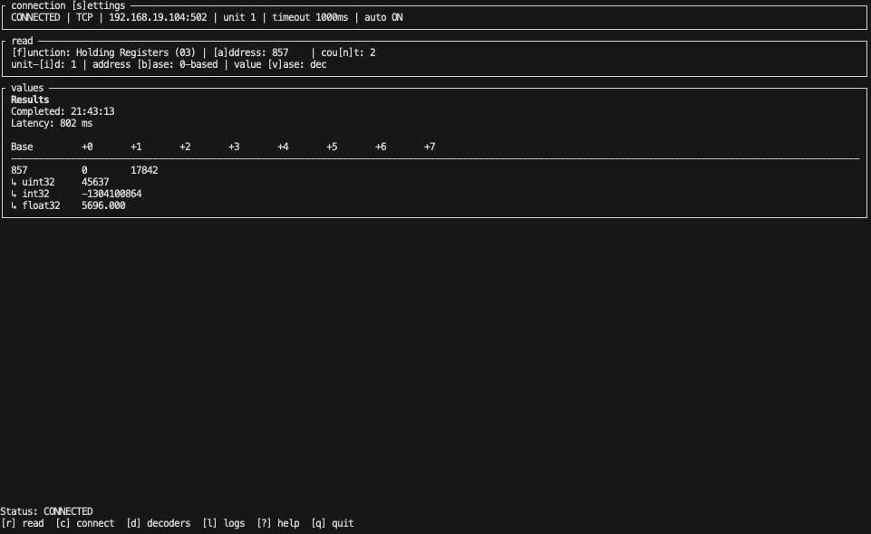
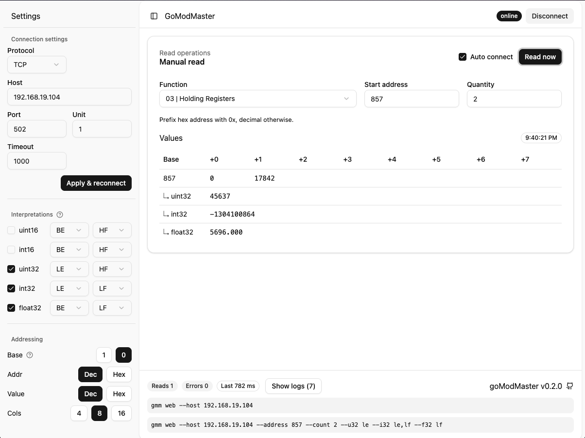

# goModMaster

Single binary Modbus master client with tui/web interface. Inspired by [QModMaster](https://sourceforge.net/projects/qmodmaster/).

tui:



web:



## Features

- [x] Read-only Modbus client (TCP + RTU)
- [x] TUI mode
- [ ] automatic polling
- [ ] Write operations (planned)

## Install

No install needed. Download the binary from latest [release](https://github.com/d21d3q/goModMaster/releases/latest) and run it.

## How to use
Run either the TUI or the web UI:

```bash
gmm
gmm web
```

By default web UI is protected with a one-time token printed at startup; use `--no-token` to disable it.

Connection and read defaults can be set at startup via CLI flags or adjusted in the UI. On exit, the app prints the current settings so you can resume with the same configuration later. 

Use `--help` for full flag details.

# Disclaimer

This tool has been vibecoded. 